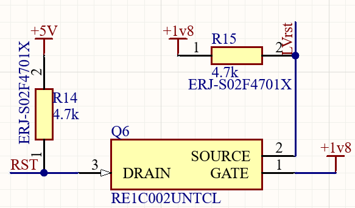
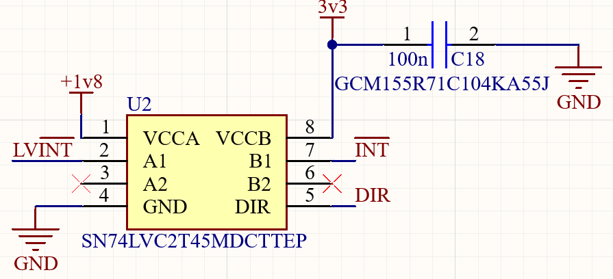
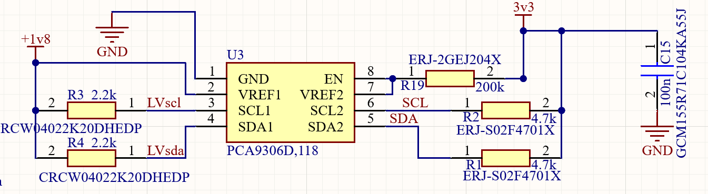
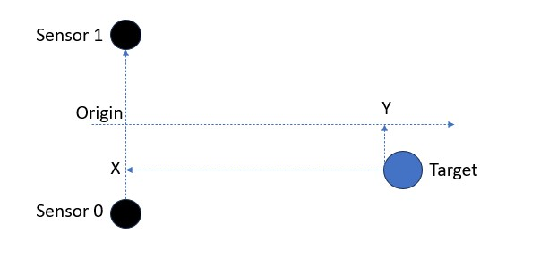
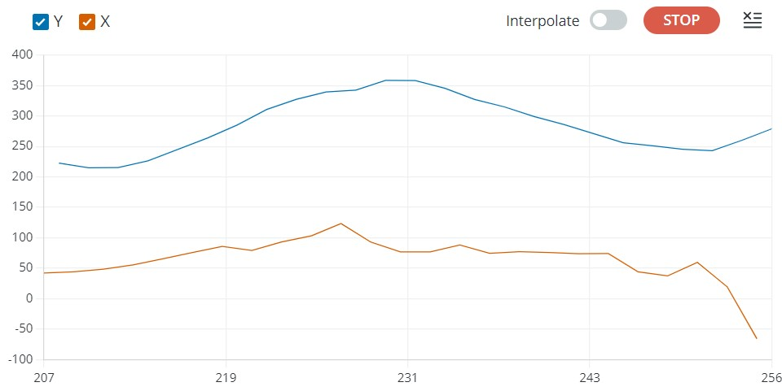
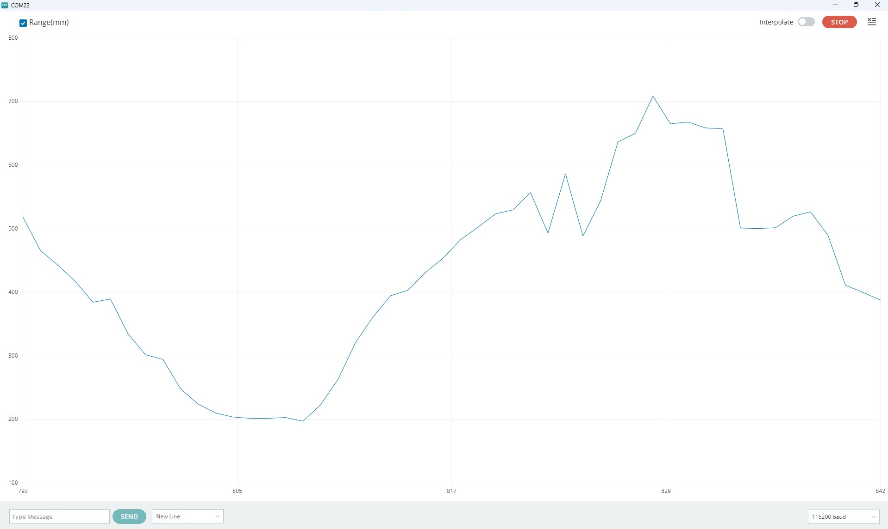

# CHx01 Arduino library
This Arduino library for the [TDK/Invensense CHx01 Time-of-Flight sensors](https://invensense.tdk.com/smartsonic/).
The CHx01 devices are miniature, ultra-low power, long-range ultrasonic Time-of-Flight (ToF) range sensors.
This library supports CH101 and CH201 devices.

This library operates correctly when the hardware circuit is implemented according to the specifications provided in the manufacturer's datasheet. The circuit configuration used in this implementation is documented in the accompanying figures (see Circuit Diagrams section).

# Updates compared to the main library

This section provides a summary of the modifications made to the main library.

**Serial output flexibility**

The driver has been modified to provide enhanced flexibility for serial communication output. A configurable serial port selection mechanism has been implemented in the CHx01_dev class to support different hardware platforms.
Within the CHx01_dev(void) constructor, the following preprocessor conditional has been added to enable platform-specific serial port assignment:

```C++
  #if defined(STM32F407xx) || defined(STM32F407)
    outputSerial = &Serial3;
  #else
    outputSerial = &Serial;
  #endif
```
Steps to add a new microcontroller and Serial output:

1- Identify the preprocessor definition for your target microcontroller

2- Determine the appropriate serial port instance (e.g., Serial, Serial1, Serial2, etc.)

3- Add the platform condition to the preprocessor block in both constructors

4- Recompile the library for your target platform


**Set the direction of the INT pin level shifter**

The sensor datasheet explicitly requires a bidirectional level shifter for the INT pin. This hardware component is essential because the INT pin operates in two distinct modes:

1- Initialization Mode: The microcontroller drives the INT pin (OUTPUT direction)

2- Application Mode: The sensor drives the INT pin to send interrupt signals (INPUT direction)

The SN74LVC2T45 is the bidirectional level shifter that I have used in the test system. It provides the necessary direction control for proper INT pin operation.

DIR Pin State Data Flow Direction Mode:

LOW (0) Microcontroller → Sensor Initialization (MCU controls INT)

HIGH (1) Sensor → Microcontroller Application (Sensor sends interrupts)

To ensure correct bidirectional operation, the following direction definitions have been implemented in CHx01_dev.h:

```C++
#define CHX01_INT_DIR_OUT (0)
#define CHX01_INT_DIR_IN  (1)
```

**Increase the number of I/Q samples**

The maximum number of I/Q samples for CH101 and CH201 is 225 and 450, respectively. Increase them in ch_common.c to achieve more reliable output. 

```C++
#define CH_IQ_SAMPLES_PER_READ 225//450//64   
```

**Added example**

I have added an example to the example folder. The example uses an STM32F407 to communicate with a CH101. 

# Software setup
Download this repository and add it to the Arduino libraries available in your .../Documents\Arduino folder of your computer. 

# Circuit Diagram 
The figures below show the use of discrete level-shifting components: a MOSFET-based circuit for the reset pin, a PCA9306D for I²C voltage translation, and an SN74LVC2T45 for INT pin logic control. A basic resistor divider is also employed to generate the 1.8 V logic level for the CH101’s PROG pin. 








# Library API

## Create CHx01 instance

**CH101(TwoWire &i2c_ref, uint8_t int1_id, uint8_t int_dir_id, uint8_t reset_id, uint8_t prog_id, bool rst_n=true)**

Create an instance of the CH101 that will be accessed using the specified I2C. The IO numbers to be used as interrupt, interrupt direction,
reset and program must be specified.  
Reset pin is active LOW by default; set rst_n to false to make it active HIGH (required for the Ultrasonic ToF EVK board).
If the int_dir pin is not used, it can be  set to UNUSED_PIN.

```C++
CH101 CHx01(Wire,2,8,9,10,false);
```

**CH201(TwoWire &i2c_ref, uint8_t int1_id, uint8_t int_dir_id, uint8_t reset_id, uint8_t prog_id, bool rst_n=true)**

Create an instance of the CH201 that will be accessed using the specified I2C. The IO numbers to be used as interrupt, interrupt direction,
reset and program must be specified.  
Reset pin is active LOW by default, set rst_n to false to make it active HIGH (required for the Ultrasonic ToF EVK board).
If int_dir pin is not used, it can be  set to UNUSED_PIN.

```C++
CH201 CHx01(Wire,2,8,9,10,false);
```

## Initialize the CHx01
Call the begin method to execute the CHx01 initialization routine. 

**int begin()**

Initializes all the required parameters in order to communicate and use the CHx01 sensor.

```C++
CHx01.begin();
```

## Start sensor

**int free_run()**

This method configure and starts the sensor in free run mode with maximum detection range and a measure interval set to 100ms.

```C++
CHx01.free_run();
```

**int free_run(uint16_t max_range_mm, uint16_t interval)**

This method configure and starts the sensor in free run mode with a detection range and a measure interval provided by the user.
Maximum detection range is in mm, maximum values are 1200 mm for CH101 and 5000 mm for CH201. 
Measure interval is in ms. 

```C++
CHx01.free_run(500, 200);
```


## Get Sensor Data

**bool data_ready()**

The function returns true if a measure is available, false if not.

```C++
if(CHx01.data_ready())
{
    Serial.println("A measure has completed");
}
```

**uint8_t get_iq_data(ch_iq_sample_t&ast; iq_data, uint16_t nb_samples)**

This method gets the sensor raw I/Q data.
The function returns 0 when successful (non-zero value if an error occurs).
*iq_data* must be an array of *CH101_MAX_NUM_SAMPLES* or *CH201_MAX_NUM_SAMPLES* elements of *ch_iq_sample_t* (see definition below)

```C++
ch_iq_sample_t raw_data[CH101_MAX_NUM_SAMPLES];
uint16_t nb_samples;
/* Get raw data from the sensor */
CHx01.get_iq_data(raw_data,&nb_samples);
Serial.println("CHx01 Raw Data");
for (int count = 0; count < nb_samples; count++) {
  /* output one I/Q pair per line */
  Serial.print(raw_data[count].q);
  Serial.print(",");
  Serial.println(raw_data[count].i);
}
```

**ch_iq_sample_t**

This structure is used by the CHx01 driver to return raw I/Q sensor data. Available data is:

|Field name|description|
| --- | --- |
| q | Q component of sample |
| i | I component of sample |


## Get range with CHx01 instance

**float get_range(void)**

This method returns the detected range in mm.
Range is set to 0, if no target is found.

```C++
float range_mm = CHx01.get_range();
Serial.print("Range(mm):");
Serial.println(range_mm);
```

## Using 2 sensors

**CH101_dev(TwoWire &i2c_ref, uint8_t i2c_addr, int int1_id, int int_dir_id, int prog_id)**

This method creates an instance of CH101 device, using provided I2C instance and address, and specified pins for interrupt, int direction and program.

```C++
CH101_dev dev0(Wire, CHIRP_DEVICE0_I2C_ADDR, 2, 8, 10);
```

**CH201_dev(TwoWire &i2c_ref, uint8_t i2c_addr, int int1_id, int int_dir_id, int prog_id)**

This method creates an instance of CH201 device, using provided I2C instance and address, and specified pins for interrupt, int direction and program.

```C++
CH201_dev dev0(Wire, CHIRP_DEVICE0_I2C_ADDR, 2, 8, 10);
```

**CHx01(CHx01_dev& dev0, CHx01_dev& dev1, int rst_id, bool rst_n=true)**

This method creates a group of CHx01 devices with dev0 & dev1, using specified pin for reset (rst_n specifies its polarity).  
In order to work together, CHx01 devices must be part of a sensor group.

```C++
CH101_dev dev0(Wire, CHIRP_DEVICE0_I2C_ADDR, 2, 8, 10);
CH101_dev dev1(Wire, CHIRP_DEVICE0_I2C_ADDR, 3, 8, 11);
CHx01 CHx01(dev0,dev1, 9, false);
```

**int start_trigger(uint16_t range_mm)**

When using multiple CHx01 sensors, they must be synchronized to work together.
This method starts first sensor as "emitter and receiver" and second sensor as "receiver only".
Measurements will be triggered using the interrupt pins.
The max range must be specified in mm.

```C++
CHx01.start_trigger(500);
```

**void trig(void)**

This method is used to trigger a measurement for a group of CHx01 sensors.

```C++
CHx01.trig();
```

**bool data_ready(int sensor_id=0)**

The function returns true if a measure is available for the specified sensor id, false if not.

```C++
if(CHx01.data_ready(0)&&CHx01.data_ready(1))
{
    Serial.println("A measure has completed");
}
````

**int triangulate(const float distance_between_sensors_mm, float& x, float& y, float offset=0)**

This method is used to compute the plane triangulation of a target using CHx01 measurements.
To get a valid triangulation using this method, CHx01 sensors must be placed at a certain distance and must be "looking" into the same direction.
The distance between the sensors must be specified as an input, *x* and *y* are the triangulation ouputs.
The *x* output corresponds to the target "left-right" position, while *y* corresponds to the distance of the object.
The method returns negative value if the triangulation computation is impossible (no target or multiple targets detected,...), 0 otherwise.
A distance offset might be specified in case measured sensor ranges are not aligned.

```C++
float x,y;
if(CHx01.triangulate(DISTANCE_BETWEEN_SENSORS_MM,x,y)==0)
{
  Serial.print("X:");
  Serial.println(x);
  Serial.print(" Y:");
  Serial.println(y);
}
```



# Available Sketches

**CH101_TargetDetection**

This sketch initializes a CH101, and starts the Time-of-Flight in free run mode. The detected range is printed on the Serial monitor, and can be plotted with the Serial plotter.  
**Note:** There are two different CH101 modules available, featuring ultra-sound horns with different Field of View.
The omnidirectional module detects target at 180° at a reduced range, while the 45° module is more directive and allows detections at a higher range.


**CH101_RawData**

This sketch initializes a CH101, and starts the Time-of-Flight in free run mode. For each sample, the raw I/Q data is printed on the Serial monitor.

**CH101_Triangulation**

This sketch initializes a group of two CH101 sensors, and starts the triangulation. It uses omnidirectional horns with a distance of 60mm between sensors. For each sample, X and Y target coordinates are printed on the Serial monitor.



**CH201_TargetDetection**

This sketch initializes a CH201, and starts the Time-of-Flight in free run mode. The detected range is printed on the Serial monitor, and can be plotted with the Serial plotter.



**CH201_RawData**

This sketch initializes a CH201, and starts the Time-of-Flight in free run mode. For each sample, the raw I/Q data is printed on the Serial monitor.

**CH201_Triangulation**

This sketch initializes a group of two CH201 sensors, and starts the triangulation. It uses a distance of 105mm between sensors. For each sample, X and Y target coordinates are printed on the Serial monitor.


# Additionnal Sketches

**CH101_MicroROS_Publisher**

This sketch initializes the CH101 device and the microROS Arduino environment to log target range sensor data. Sensor data is published in a Range structure. For more information, refer to MicroROS_README.md.

**CH201_MicroROS_Publisher**

This sketch initializes the CH201 device and the microROS Arduino environment to log target range sensor data. Sensor data is published in a Range structure. For more information, refer to MicroROS_README.md.
